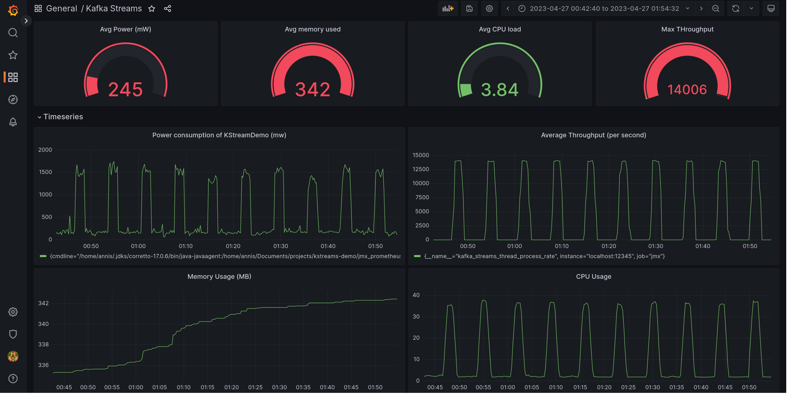

# Stream Processing Benchmark
A benchmark of performances between three different stream processors: Kafka Streams, Apache Flink and Spark Streaming.

## Technologies:
This benchmark uses Java for simulating a CPU intensive workload that is sent to three different stream processors:
- Kafka Streams `KafkaProcessor`
- Apache Flink : `FlinkProcessor` 
- Spark Streaming: `SparkProcessor` 

We used JMX to collect the performance metrics and we stored them in Prometheus, Grafana is used for displaying results.

## Results

Below are example of results for Kafka Streams with Grafana.

